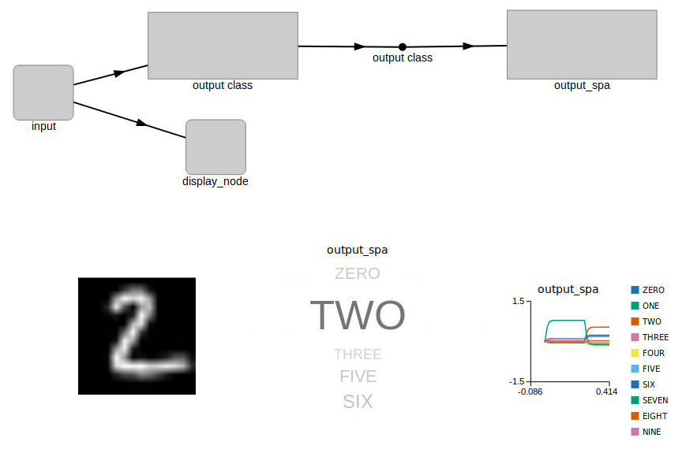
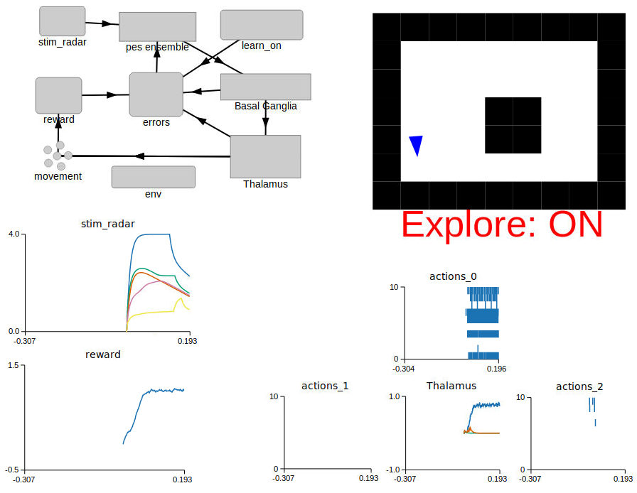

.. _examples:

********
Examples
********

NengoFPGA has a few examples to show you what's possible and get you started.
There are some simple examples that are built with Jupyter
notebooks that illustrate the code with interspersed text information.
These notebook examples use the :ref:`scripting <scripting>` mode of
NengoFPGA without needing NengoGUI.

There are also some more complex examples that are not built in notebooks
and instead use NengoGUI. These examples are more complex and some have
opportunities for you to interact with the system via the GUI.

Notebook Examples
=================

These example notebooks are statically rendered here for your perusal.
If you wish to experiment with these examples yourself, you can do so by
running the notebook from your own computer.
See :ref:`Using Jupyter Notebooks <jupyter>` for help.

.. toctree::
   :maxdepth: 1

   examples/notebooks/00-communication-channel
   examples/notebooks/01-learn-communication-channel
   examples/notebooks/02-set-neuron-params
   examples/notebooks/03-integrator
   examples/notebooks/04-oscillator
   examples/notebooks/05-controlled-oscillator
   examples/notebooks/06-chaotic-attractor

GUI Examples
============

.. |gui_dir| replace:: ``nengo_fpga/docs/examples/gui``

These examples are designed to be used with NengoGUI, so it will have to be
installed. This can be done by running ``pip install nengo-gui`` from your
command line.

.. rst-class:: compact

1. Install the GUI:

   .. code-block:: bash

      pip install nengo-gui

#. In a terminal, navigate to the |gui_dir| directory.
#. Run one of the examples by running the command:

   .. code-block:: bash

      nengo <file name> -b nengo_fpga

   where ``<file name>`` is the filename of the example. The ``-b nengo_fpga``
   indicates to the GUI to use the NengoFPGA backend (``nengo_fpga``) instead
   of standard Nengo backend.

   Successfully running the ``nengo`` command will open the NengoGUI
   interface in a web browser. On the right, you will see the code for the
   example Nengo model, and on the left is a graphical representation of the
   Nengo model.

#. In the code for each example, somewhere near the top of the file, you
   should see a code block like so:

   .. code-block:: python

      # ---------------- BOARD SELECT ----------------------- #
      # Change this to your desired device name
      board = 'de1'
      # ---------------- BOARD SELECT ----------------------- #

   To run the code with your system configuration, change the value of the
   ``board`` variable to the desired board defined in the ``fpga_config`` file
   (i.e., the board names defined in the ``fpga_config`` file). Refer to the
   :ref:`NengoFPGA configuration file <nengofpga-config>` section
   for help on how to properly set up the ``fpga_config`` file.
#. To start the simulation of the neural model, click the play button in the
   bottom right of the window. Note that it may take several seconds for the
   model to build and start running.

MNIST Digit Classifier
----------------------

This is an example of a one-layer vision network that is trained to classify
scaled down versions of the handwritten digits from the MNIST dataset. The
model takes as input the MNIST image, and produces as output the classification
confidence for each one of the 10 (zero through nine) possible number classes.

This example has some additional requirements, be sure you have the following
required packages installed:

1. NengoExtras: ``pip install nengo_extras``
#. Python image library: ``pip install pillow``

To run this example in Nengo, from the |gui_dir| directory, run:

.. code-block:: none

   nengo 00-mnist-vision-network.py -b nengo_fpga

.. note::

   On the first run of the MNIST example, the python code downloads the MNIST
   data set from `<http://deeplearning.net/data/mnist/mnist.pkl.gz>`_ into the
   |gui_dir| directory. The data set is approximately 16MB in size and may
   take a while to download (depending on the speed of your internet
   connection). Please do not interrupt the script while the download is
   occurring.

   If the download is interrupted, and the downloaded data set file
   (``mnist.pkl.gz``) is corrupted, simply delete the ``mnist.pkl.gz`` file
   from the |gui_dir| directory and re-run the script. You may also download
   the data set directly from the link above and place it in the |gui_dir|
   directory.

When the model is loaded into NengoGUI, you should see a graphical
representation similar to the image below.

In the top half of the graphical pane, you should see the high-level
representation of the MNIST network. The bottom half of the graphical pane
is divided into three sections:

- The digit being presented to the network is shown on the left.
- A visual representation (``output_spa``) of the output classification of the
  network. The size of the text corresponds to the model's confidence in the
  output classification.
- The numerical representation of the ``output_spa`` graphic is shown on the
  right. This graph shows the model's confidence of each number class as they
  relate to each other. The higher the graph line, the more confidence the
  model has in that one particular number class.

When the simulation is run, you should see an output like the image below.

.. image:: _static/mnist.gif
  :alt: MNIST Simulation
  :width: 75%
  :align: center

Adaptive Pendulum Control
-------------------------

.. |nbsp|   unicode:: U+00A0 .. NO-BREAK SPACE

This example demonstrates the use of an adaptive controller to control a
weighted inverted pendulum that is affected by gravity. The controller used is
the combination of a standard Proportional-Derivative (PD) controller with an
adaptive neural ensemble. Together, these two components implement a
Proportional-Integral-Derivative (PID) controller, where the integral
term is adaptive and compensates for changing steady state error as gravity
acts on the system.

To run this example in Nengo, from the |gui_dir| directory, run:

.. code-block:: none

   nengo 01-adaptive-pendulum.py -b nengo_fpga

When the model is loaded into NengoGUI, you should see a graphical
representation similar to the image below.

.. image:: _static/pendulum_gui.png
  :alt: Inverted Pendulum Example GUI
  :width: 100%

In the top half of the graphical pane, you should see the high-level
representation of the MNIST network. The bottom half of the graphical pane
is divided into two sections:

.. rst-class:: compact

- Two sliders on the left:

  - **Target Pendulum Angle** is the desired angle of the pendulum. The
    angle is defined as the amount of radians from the vertical (positive
    radians to the right, negative radians to the left). By default, this
    slider is set to automatically oscillate between 1 and -1 radians, but
    you are able to manually move it if desired.
  - **Extra Mass** controls the amount of additional mass added to the
    pendulum. The mass is defined in units of kg, and the pendulum starts with
    a mass of 1kg.

- The pendulum visualization on the right:

  - The blue line represents the target, or desired position of the
    pendulum.
  - The black line is the representation of the actual position of the
    pendulum that is being controlled by the adaptive PID controller.

When the simulation is running, you should see the pendulum like the one in
the image on the left below. Observe that as the simulation progresses,
the actual position of the pendulum converges to that of the target angle.
As a comparison, the image on the right below show the same pendulum
controlled by a standard PD controller. It can be seen that in this case,
the actual position of the pendulum never converges to the desired target
angle.

.. list-table::
  :widths: 50 50
  :align: center

  * -

     .. image:: _static/pendulum.gif
        :alt: Inverted Pendulum Simulation

     |nbsp| |nbsp| |nbsp| |nbsp| Adaptive Controller

    -

     .. image:: _static/pendulum_no-learn.gif
        :alt: Inverted Pendulum Adaptive Simulation

     |nbsp| |nbsp| Non-adaptive Controller

You can also try moving the **Extra Mass** slider up or down in the GUI and
observe how the added or reduced mass affect the position of the pendulum,
especially as it approaches the horizontal position where the torque due to
gravity is at its peak.

Reinforcement Learning
----------------------

This example demonstrates how an adaptive FPGA ensemble can be used to
implement an agent capable of reinforcement learning. The agent can perform
three actions (go forward, rotate clockwise, rotate counter-clockwise), and
has a 5-point "radar" that provides it the distance to any obstacles directly
ahead, directly to its sides, and on the forward diagonals.

The agent is controlled by a basal ganglia (BG) action selection system that
determines which of the three actions the agent is to perform, based on the
input utility values to the basal ganglia.

The radar data is fed into the adaptive FPGA ensemble to compute the BG
utility values. When the simulation starts, the BG utility values start at
0.8 for moving forward, and 0.7 and 0.6 for rotating counter-clockwise and
clockwise respectively. Thus, if the utility values are not modified,
the agent should be biased to move in a forward direction.

A reward system is set up to give a positive value when moving forward, and
no reward if the agent is stationary or has crashed into a wall.  In theory,
this should cause it to learn to avoid obstacles.  In particular, it will
start to turn before it hits the obstacle, as a continual forward movement
(albeit at an angle) will provide it with a higher reward.

From the reward system, an error signal is computed. The error signal in this
case is very simple: the difference between the computed utility and the
instantaneous reward.  This error signal should only be applied to whatever
action is currently being chosen (although it isn't quite perfect at doing
this).  Note that this means it *cannot* learn to do actions that will lead to
*future* rewards.

The error signal is fed into the adaptive FPGA ensemble to modulate it's,
which in turn modifies the mapping between the different radar states and the
learned action. In this way, the agent learns to associate specific radar
states with the action that will provide it the highest reward (and hopefully
avoid the walls).

To run this example in Nengo, from the |gui_dir| directory, run:

.. code-block:: none

   nengo 02-RL-demo.py -b nengo_fpga

When the model is loaded into NengoGUI, you should see a graphical
representation similar to the image below.

For this example, the graphical pane is divided into four quadrants.

- In the top left quadrant, the network diagram for this example is displayed.
- In the bottom left quadrant, the values for the radar (``stim_radar``) and
  the reward values associated with the agent's current action (``reward``) are
  shown.
- A graphical representation of the world map, and the agent's current location
  in this map is displayed in the top right quadrant. The agent is represented
  as a blue triangle, and the obstacles in the world with black squares. When
  the agent encounters an obstacle, it changes from a blue to a red colour.
  Also indicated is the current "learning" state of the agent -- the agent
  is learning when **Explore** is **ON**, and conversely, is not adapting to
  the reward signals when **Explore** is **OFF**. If the ``keyboard-state``
  branch of the NengoGUI is being used, the learning mode of the agent can
  be controlled using keyboard presses (see :ref:`below <keyboard-state>`).
- The bottom right quadrant displays the output of the action selection network
  (``Thalamus``), as well as the associated spike rasters for each action:

  * ``actions_0``: Move forward
  * ``actions_1``: Turn counter-clockwise
  * ``actions_2``: Turn clockwise

When the simulation is running, the agent should move around the world, as
shown in the images below. The images below also show the agent moving around
the world in 3 modes:

1. Exploring: The agent is constantly using the error signal to learn
   which is the best action to perform.
#. Exploiting: The learning has been disabled after the agent has spent
   about 15 seconds in the "Exploring" mode. The agent is thus moving
   about the world using the radar-to-action mapping it had learned in the
   exploration phase.
#. No Learning: The simulation is started with learning disabled. In this
   scenario, the agent moves forward, encounters a wall, and is unable to
   recover.

.. list-table::
  :widths: 33 33 33
  :align: center

  * -

     .. image:: _static/rl_explore.gif

     |nbsp| |nbsp| |nbsp| Exploring

    -

     .. image:: _static/rl_exploit.gif

     |nbsp| |nbsp| |nbsp| Exploiting

    -

     .. image:: _static/rl_no-learn.gif

     |nbsp| |nbsp| |nbsp| No Learning

Changing the world layout
^^^^^^^^^^^^^^^^^^^^^^^^^

Near the top of the file, a section of code defines the layout of the world
the agent is exploring. The section of code looks something like:

.. rst-class:: compact

   .. code-block:: python

          world_maps = ["""
      #########
      #       #
      #       #
      #   ##  #
      #   ##  #
      #       #
      #########""",

You can alter the default world map by changing the first entry in the
``world_maps`` list. Obstacles are indicated with the ``#`` character, and
unobstructed space is indicated with the space character. The world map can
be increased or decreased in size by altering the number of rows and columns
that make up the map.

.. _keyboard-state:

Controlling the simulation with the keyboard
^^^^^^^^^^^^^^^^^^^^^^^^^^^^^^^^^^^^^^^^^^^^

You should see instructions printed in the console pane on the bottom right.
These instructions will inform you on which keyboard presses can be used to
disable or permanently enable learning; reset the agent's location back to the
start location; and change the world map.

If you do not see instructions for key presses then this feature is currently
not available with your installed version of NengoGUI.
