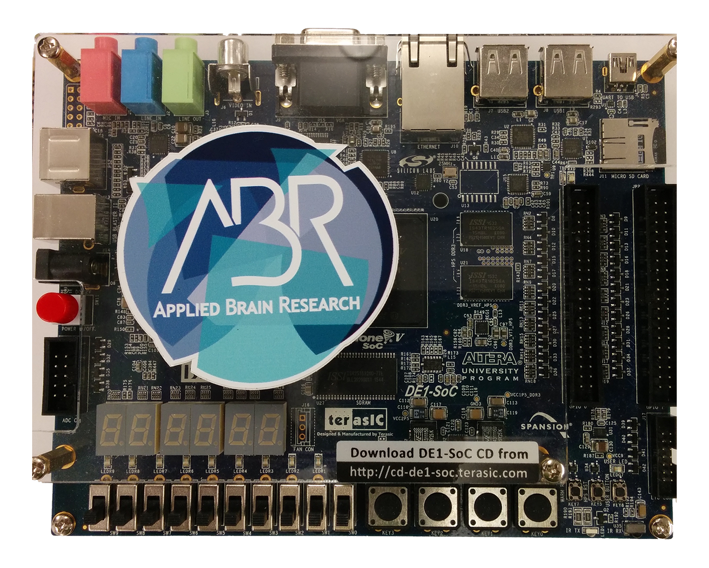
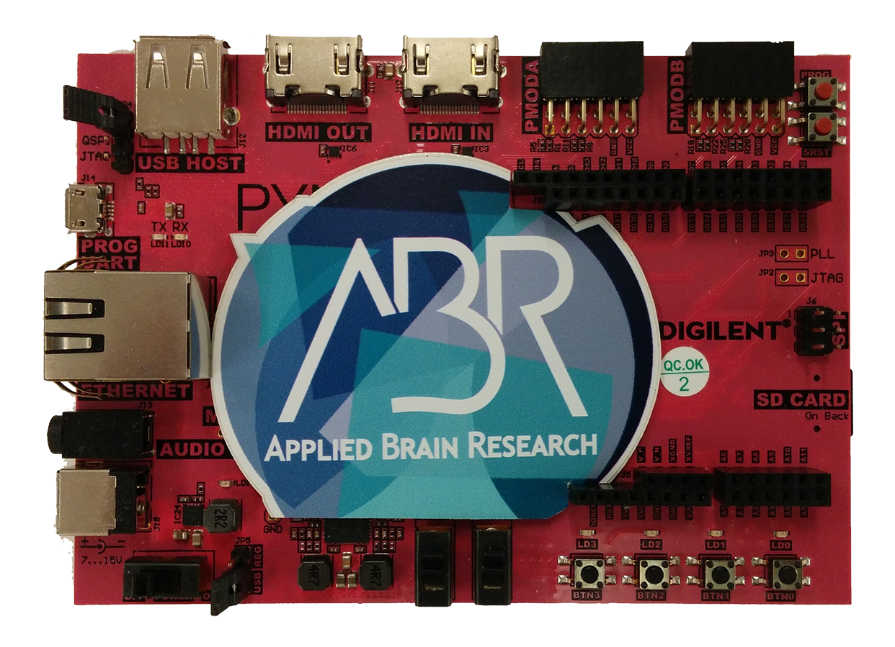
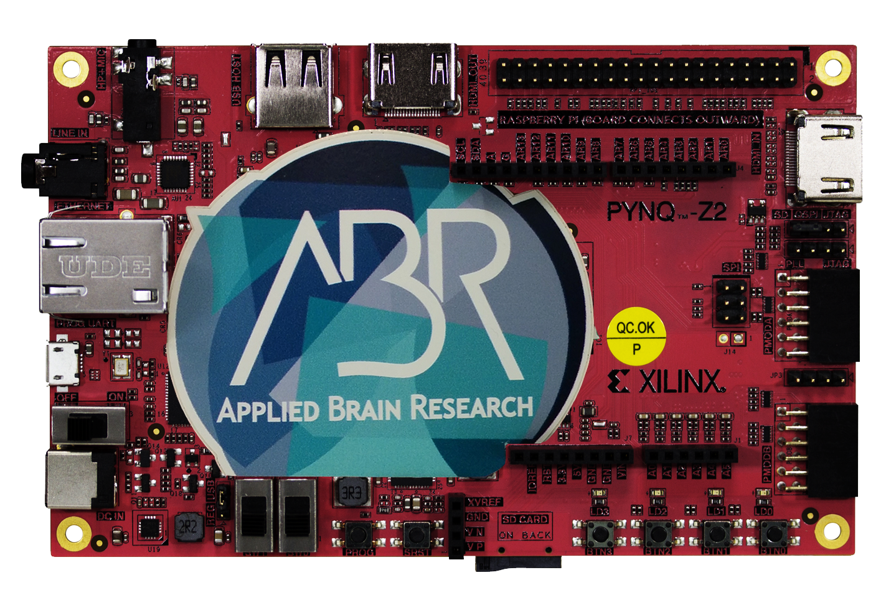

********
Appendix
********

.. _supported-hardware:

Supported Hardware
==================

IP packages can be purchased through `Applied Brain Research
<https://store.appliedbrainresearch.com/collections/nengo-fpga>`_.

DE1-SoC
-------

.. Pipes add vertical space

|
|

The DE1-SoC board is manufactured by Terasic and uses an Intel Altera Cyclone V
FPGA paired with a dual core ARM Cortex A9. The board is available for `purchase
from Terasic
<https://www.terasic.com.tw/cgi-bin/page/archive.pl?Language=English&No=836>`_.
See the :std:doc:`NengoDE1 documentation <nengo-de1:index>` for how to use this
board with NengoFPGA.

|
|

PYNQ-Z1
-------

|
|

The PYNQ-Z1 board is manufactured by Digilent and uses a ZYNQ 7020 FPGA paired
with a dual core ARM Cortex A9. The board is available for `purchase from
Digilent
<https://store.digilentinc.com/pynq-z1-python-productivity-for-zynq-7000-arm-fpga-soc/>`_.
See the :std:doc:`NengoPYNQ documentation <nengo-pynq:index>` for how to use
this board with NengoFPGA.

|
|

PYNQ-Z2
-------

|
|

The PYNQ-Z2 board is manufactured by TUL and uses a ZYNQ 7020 FPGA paired
with a dual core ARM Cortex A9. The board is available for `purchase from
TUL (or one of their international distributors)
<http://www.tul.com.tw/ProductsPYNQ-Z2.html>`_.
See the :std:doc:`NengoPYNQ documentation <nengo-pynq:index>` for how to use
this board with NengoFPGA.

|
|
|

.. _ssh-key:

Generating and Using SSH keys
=============================

SSH keys allow SSH connections to be made without the need for a password. SSH
keys operate in pairs: a *private key* kept on the host (local) machine, and a
*public key* copied to the ``authorized_keys`` file on the FPGA board.

To generate and use an SSH key with NengoFPGA, follow the instructions below.
To support both the Windows and Unix-based operating systems, NengoFPGA uses
SSH keys using the OpenSSH format.

Windows
-------

The best way to generate an SSH key in Windows is to use PuTTY_.

.. _PuTTY: https://www.chiark.greenend.org.uk/~sgtatham/putty/latest.html

1. Download and install PuTTY_.
#. Under the **PuTTY** group in the windows start menu, run the **PuTTYgen**
   application.
#. Click the **Generate** button, and follow the on-screen instructions to
   generate a random SSH key pair.

Exporting the SSH *private key*:

1. Click the **Conversions** drop-down menu, and select **Export OpenSSH key**.
   Leave the **Key passphrase** blank.
#. Choose a save location for the SSH key (e.g., the install location of
   ``nengo-fpga``).

Exporting the SSH *public key*:

1. Keep PuTTYgen open. Do not regenerate the SSH key pair.
#. SSH into the FPGA board using a username and password combination.
   The username used will have the SSH keys generated with these steps
   associated with it.
#. Edit the ``~/.ssh/authorized_keys`` file with a text editor
   (e.g., ``nano``, ``vi``).
#. Copy the *public key* text from the **Public key for pasting into OpenSSH
   authorized_keys file** area of PuTTYgen and paste it at the end of the
   ``authorized_keys`` file.

Linux and Mac
-------------

.. rst-class:: compact

1. On your computer, open a terminal. If SSH has not installed been installed
   on your computer, install it with ``sudo apt-get install ssh`` (Linux) or
   ``sudo brew install ssh`` (Mac).
#. Enter the command: ``ssh-keygen -t rsa``
#. The command above will prompt for a location to save the SSH *private key*.
   Leaving this blank will save it to the default location of ``~/.ssh/id_rsa``.
#. The ``ssh-keygen`` command will also prompt for a passphrase. Leave the
   passphrase empty (press **↵ Enter** twice).
#. Copy the SSH *public key* to the FPGA board with the command:

   .. code-block:: bash

      ssh-copy-id -i <location of private key> <ssh username>@<FPGA board IP>

   For example:

   .. code-block:: bash

      ssh-copy-id -i ~/.ssh/id_rsa.pub xilinx@10.162.177.99

   .. note::
      If the ``ssh-copy-id`` command does not work, or is unavailable, copy the
      contents of the ``*.pub`` file (this is the generated SSH *public key*)
      located in the same location as the SSH *private key* into the
      ``~/.ssh/authorized_keys`` of the appropriate user on the FPGA board.

Configuring the ``fpga_config`` File
------------------------------------

After generating the SSH key pair, test that they have been properly installed
by SSH'ing into the FPGA board. If a connection is made without needing to
provide a password, then the SSH key has been successfully installed.

If the SSH key has been successfully installed NengoFPGA can be configured to
use the keys by replacing the **ssh_pwd** entry with **ssh_key**, and providing
the location of the SSH *private key* on the host system. As an example, if the
SSH *private key* is located in ``~/.ssh/id_rsa`` on the host system, the
**ssh_key** entry would be:

.. code-block:: none

   ssh_key = ~/.ssh/id_rsa

.. note::
   The config file can have *either* an **ssh_pwd** entry or an **ssh_key**
   entry but **not both**.

.. _ip-addr:

Finding your IP Address
=======================

To find the IP address of your computer follow the instructions for your
operating system below.

.. note::
   Ignore any address like **127.0.0.1**

..
   .. todo::
      Maybe add screenshots?

Windows
-------
1. Press **⊞ Win** + **r** to open the **Run** dialog box.
#. Type in ``cmd`` and press **↵ Enter** to open the windows command prompt.
#. Type ``ipconfig``, and look for the **IPv4 Address** entry of the desired
   network interface. This is your IP address.

.. |winkey| unicode:: 0x229E

Linux and Mac
-------------

1. Open a terminal and type ``ifconfig | grep "inet "``

.. _jupyter:

Using Jupyter Notebooks
=======================

Jupyter notebooks are a nice way to add explanations to your code and step
through systems piece by piece. NengoFPGA uses notebooks to illustrate
some simple examples. The following instructions will get you started with
Jupyter so you can run the examples locally or create your own notebook!

.. rst-class:: compact

1. Install Jupyter:

   .. code-block:: bash

      pip install jupyter

#. Start a local Jupyter server:

   i. In a terminal, navigate to the examples folder,
      ``nengo_fpga/docs/examples/notebooks``.
   #. Start the server with:

      .. code-block:: bash

         jupyter-notebook

      This will open a file explorer in your browser.

#. Open a notebook by double clicking on one of the ``.ipynb`` files.
#. You may need to select a kernel, the Python engine that will run code
   under the hood for you. At the top, click the **kernel** menu then hover
   over **Change kernel** and select the desired Python version.
#. Click on the first code cell in the notebook and execute it by clicking
   the play button at the top or pressing **Shift+Enter**. This will run the
   code in the current cell and move you to the next cell in the notebook.
#. Step through the notebook by continuing to execute cells, you can execute
   the text cells as cell, so no need to jump down and click on each code cell!

.. note::
   Be sure to execute cells in order otherwise you may get unexpected results.
   If you make changes to code in a cell be sure to rerun that cell and any
   other cells affected by that change!
